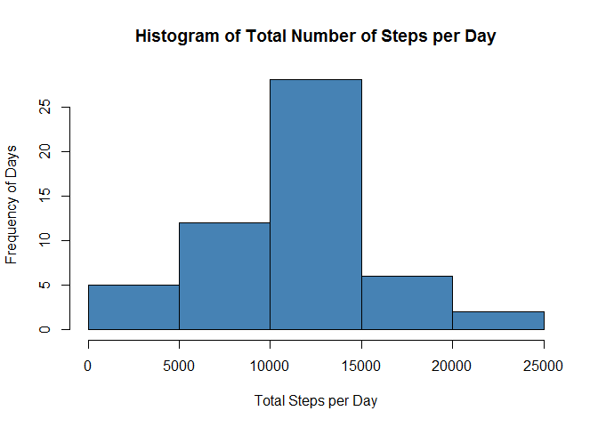
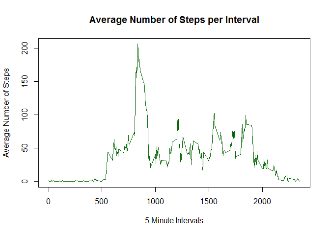
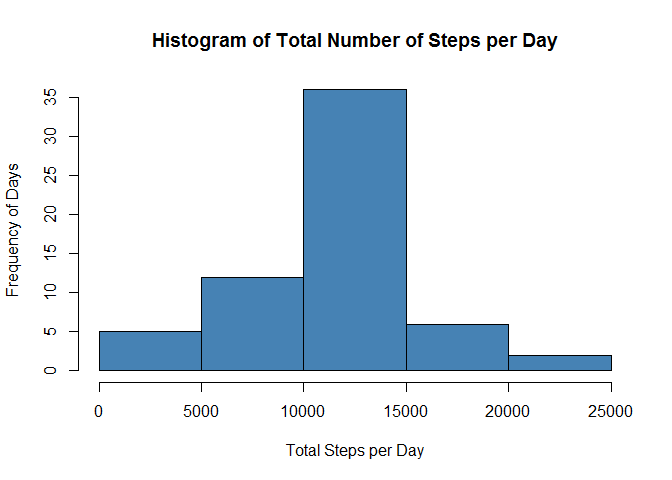
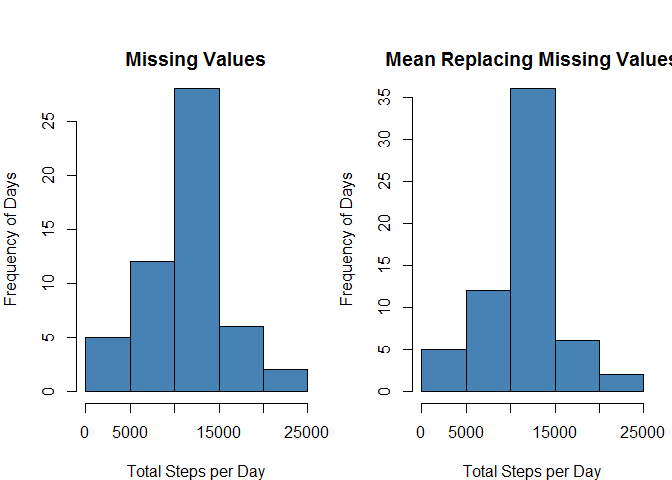
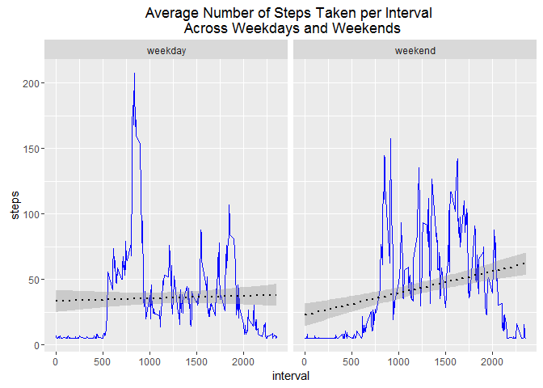

#Loading and pre-processing the data.

Load knitr package

```r
library(knitr)
```

Set the Working Directory.

```r
opts_knit$set(root.dir = "C:/RStudio/Coursera/Reproducible Research")
```

Read the dataset.

```r
activity <- read.csv("C:/RStudio/Coursera/Reproducible Research/Data Files/activity.csv",header = TRUE, sep = ",",stringsAsFactors = FALSE)
str(activity)
```

```
## 'data.frame':	17568 obs. of  3 variables:
##  $ steps   : int  NA NA NA NA NA NA NA NA NA NA ...
##  $ date    : chr  "2012-10-01" "2012-10-01" "2012-10-01" "2012-10-01" ...
##  $ interval: int  0 5 10 15 20 25 30 35 40 45 ...
```

Change date field from character to date.

```r
activity$date <- as.Date(activity$date)
class(activity$date)
```

```
## [1] "Date"
```

#What is the mean total number of steps taken per day?

Total number of steps each day.

```r
dailysteps <- aggregate(steps~date,activity,sum)
dailysteps
```

```
##          date steps
## 1  2012-10-02   126
## 2  2012-10-03 11352
## 3  2012-10-04 12116
## 4  2012-10-05 13294
## 5  2012-10-06 15420
## 6  2012-10-07 11015
## 7  2012-10-09 12811
## 8  2012-10-10  9900
## 9  2012-10-11 10304
## 10 2012-10-12 17382
## 11 2012-10-13 12426
## 12 2012-10-14 15098
## 13 2012-10-15 10139
## 14 2012-10-16 15084
## 15 2012-10-17 13452
## 16 2012-10-18 10056
## 17 2012-10-19 11829
## 18 2012-10-20 10395
## 19 2012-10-21  8821
## 20 2012-10-22 13460
## 21 2012-10-23  8918
## 22 2012-10-24  8355
## 23 2012-10-25  2492
## 24 2012-10-26  6778
## 25 2012-10-27 10119
## 26 2012-10-28 11458
## 27 2012-10-29  5018
## 28 2012-10-30  9819
## 29 2012-10-31 15414
## 30 2012-11-02 10600
## 31 2012-11-03 10571
## 32 2012-11-05 10439
## 33 2012-11-06  8334
## 34 2012-11-07 12883
## 35 2012-11-08  3219
## 36 2012-11-11 12608
## 37 2012-11-12 10765
## 38 2012-11-13  7336
## 39 2012-11-15    41
## 40 2012-11-16  5441
## 41 2012-11-17 14339
## 42 2012-11-18 15110
## 43 2012-11-19  8841
## 44 2012-11-20  4472
## 45 2012-11-21 12787
## 46 2012-11-22 20427
## 47 2012-11-23 21194
## 48 2012-11-24 14478
## 49 2012-11-25 11834
## 50 2012-11-26 11162
## 51 2012-11-27 13646
## 52 2012-11-28 10183
## 53 2012-11-29  7047
```

Histogram of the total number of steps taken each day.

```r
hist(dailysteps$steps,
     xlab = "Total Steps per Day",
     ylab = "Frequency of Days",
     main = "Histogram of Total Number of Steps per Day",
     col = "steelblue")
```

<!-- -->

Mean number of steps taken each day.

```r
dailymean <- aggregate(steps~date,activity,mean)
dailymean
```

```
##          date      steps
## 1  2012-10-02  0.4375000
## 2  2012-10-03 39.4166667
## 3  2012-10-04 42.0694444
## 4  2012-10-05 46.1597222
## 5  2012-10-06 53.5416667
## 6  2012-10-07 38.2465278
## 7  2012-10-09 44.4826389
## 8  2012-10-10 34.3750000
## 9  2012-10-11 35.7777778
## 10 2012-10-12 60.3541667
## 11 2012-10-13 43.1458333
## 12 2012-10-14 52.4236111
## 13 2012-10-15 35.2048611
## 14 2012-10-16 52.3750000
## 15 2012-10-17 46.7083333
## 16 2012-10-18 34.9166667
## 17 2012-10-19 41.0729167
## 18 2012-10-20 36.0937500
## 19 2012-10-21 30.6284722
## 20 2012-10-22 46.7361111
## 21 2012-10-23 30.9652778
## 22 2012-10-24 29.0104167
## 23 2012-10-25  8.6527778
## 24 2012-10-26 23.5347222
## 25 2012-10-27 35.1354167
## 26 2012-10-28 39.7847222
## 27 2012-10-29 17.4236111
## 28 2012-10-30 34.0937500
## 29 2012-10-31 53.5208333
## 30 2012-11-02 36.8055556
## 31 2012-11-03 36.7048611
## 32 2012-11-05 36.2465278
## 33 2012-11-06 28.9375000
## 34 2012-11-07 44.7326389
## 35 2012-11-08 11.1770833
## 36 2012-11-11 43.7777778
## 37 2012-11-12 37.3784722
## 38 2012-11-13 25.4722222
## 39 2012-11-15  0.1423611
## 40 2012-11-16 18.8923611
## 41 2012-11-17 49.7881944
## 42 2012-11-18 52.4652778
## 43 2012-11-19 30.6979167
## 44 2012-11-20 15.5277778
## 45 2012-11-21 44.3993056
## 46 2012-11-22 70.9270833
## 47 2012-11-23 73.5902778
## 48 2012-11-24 50.2708333
## 49 2012-11-25 41.0902778
## 50 2012-11-26 38.7569444
## 51 2012-11-27 47.3819444
## 52 2012-11-28 35.3576389
## 53 2012-11-29 24.4687500
```

Median number of steps taken each day.

```r
dailymedian <- aggregate(steps~date,activity,median)
dailymedian
```

```
##          date steps
## 1  2012-10-02     0
## 2  2012-10-03     0
## 3  2012-10-04     0
## 4  2012-10-05     0
## 5  2012-10-06     0
## 6  2012-10-07     0
## 7  2012-10-09     0
## 8  2012-10-10     0
## 9  2012-10-11     0
## 10 2012-10-12     0
## 11 2012-10-13     0
## 12 2012-10-14     0
## 13 2012-10-15     0
## 14 2012-10-16     0
## 15 2012-10-17     0
## 16 2012-10-18     0
## 17 2012-10-19     0
## 18 2012-10-20     0
## 19 2012-10-21     0
## 20 2012-10-22     0
## 21 2012-10-23     0
## 22 2012-10-24     0
## 23 2012-10-25     0
## 24 2012-10-26     0
## 25 2012-10-27     0
## 26 2012-10-28     0
## 27 2012-10-29     0
## 28 2012-10-30     0
## 29 2012-10-31     0
## 30 2012-11-02     0
## 31 2012-11-03     0
## 32 2012-11-05     0
## 33 2012-11-06     0
## 34 2012-11-07     0
## 35 2012-11-08     0
## 36 2012-11-11     0
## 37 2012-11-12     0
## 38 2012-11-13     0
## 39 2012-11-15     0
## 40 2012-11-16     0
## 41 2012-11-17     0
## 42 2012-11-18     0
## 43 2012-11-19     0
## 44 2012-11-20     0
## 45 2012-11-21     0
## 46 2012-11-22     0
## 47 2012-11-23     0
## 48 2012-11-24     0
## 49 2012-11-25     0
## 50 2012-11-26     0
## 51 2012-11-27     0
## 52 2012-11-28     0
## 53 2012-11-29     0
```

#What is the average daily activity pattern?

The average number of steps taken for each interval.

```r
intervalmean <- aggregate(steps~interval, activity, mean)
intervalmean
```

```
##     interval       steps
## 1          0   1.7169811
## 2          5   0.3396226
## 3         10   0.1320755
## 4         15   0.1509434
## 5         20   0.0754717
## 6         25   2.0943396
## 7         30   0.5283019
## 8         35   0.8679245
## 9         40   0.0000000
## 10        45   1.4716981
## 11        50   0.3018868
## 12        55   0.1320755
## 13       100   0.3207547
## 14       105   0.6792453
## 15       110   0.1509434
## 16       115   0.3396226
## 17       120   0.0000000
## 18       125   1.1132075
## 19       130   1.8301887
## 20       135   0.1698113
## 21       140   0.1698113
## 22       145   0.3773585
## 23       150   0.2641509
## 24       155   0.0000000
## 25       200   0.0000000
## 26       205   0.0000000
## 27       210   1.1320755
## 28       215   0.0000000
## 29       220   0.0000000
## 30       225   0.1320755
## 31       230   0.0000000
## 32       235   0.2264151
## 33       240   0.0000000
## 34       245   0.0000000
## 35       250   1.5471698
## 36       255   0.9433962
## 37       300   0.0000000
## 38       305   0.0000000
## 39       310   0.0000000
## 40       315   0.0000000
## 41       320   0.2075472
## 42       325   0.6226415
## 43       330   1.6226415
## 44       335   0.5849057
## 45       340   0.4905660
## 46       345   0.0754717
## 47       350   0.0000000
## 48       355   0.0000000
## 49       400   1.1886792
## 50       405   0.9433962
## 51       410   2.5660377
## 52       415   0.0000000
## 53       420   0.3396226
## 54       425   0.3584906
## 55       430   4.1132075
## 56       435   0.6603774
## 57       440   3.4905660
## 58       445   0.8301887
## 59       450   3.1132075
## 60       455   1.1132075
## 61       500   0.0000000
## 62       505   1.5660377
## 63       510   3.0000000
## 64       515   2.2452830
## 65       520   3.3207547
## 66       525   2.9622642
## 67       530   2.0943396
## 68       535   6.0566038
## 69       540  16.0188679
## 70       545  18.3396226
## 71       550  39.4528302
## 72       555  44.4905660
## 73       600  31.4905660
## 74       605  49.2641509
## 75       610  53.7735849
## 76       615  63.4528302
## 77       620  49.9622642
## 78       625  47.0754717
## 79       630  52.1509434
## 80       635  39.3396226
## 81       640  44.0188679
## 82       645  44.1698113
## 83       650  37.3584906
## 84       655  49.0377358
## 85       700  43.8113208
## 86       705  44.3773585
## 87       710  50.5094340
## 88       715  54.5094340
## 89       720  49.9245283
## 90       725  50.9811321
## 91       730  55.6792453
## 92       735  44.3207547
## 93       740  52.2641509
## 94       745  69.5471698
## 95       750  57.8490566
## 96       755  56.1509434
## 97       800  73.3773585
## 98       805  68.2075472
## 99       810 129.4339623
## 100      815 157.5283019
## 101      820 171.1509434
## 102      825 155.3962264
## 103      830 177.3018868
## 104      835 206.1698113
## 105      840 195.9245283
## 106      845 179.5660377
## 107      850 183.3962264
## 108      855 167.0188679
## 109      900 143.4528302
## 110      905 124.0377358
## 111      910 109.1132075
## 112      915 108.1132075
## 113      920 103.7169811
## 114      925  95.9622642
## 115      930  66.2075472
## 116      935  45.2264151
## 117      940  24.7924528
## 118      945  38.7547170
## 119      950  34.9811321
## 120      955  21.0566038
## 121     1000  40.5660377
## 122     1005  26.9811321
## 123     1010  42.4150943
## 124     1015  52.6603774
## 125     1020  38.9245283
## 126     1025  50.7924528
## 127     1030  44.2830189
## 128     1035  37.4150943
## 129     1040  34.6981132
## 130     1045  28.3396226
## 131     1050  25.0943396
## 132     1055  31.9433962
## 133     1100  31.3584906
## 134     1105  29.6792453
## 135     1110  21.3207547
## 136     1115  25.5471698
## 137     1120  28.3773585
## 138     1125  26.4716981
## 139     1130  33.4339623
## 140     1135  49.9811321
## 141     1140  42.0377358
## 142     1145  44.6037736
## 143     1150  46.0377358
## 144     1155  59.1886792
## 145     1200  63.8679245
## 146     1205  87.6981132
## 147     1210  94.8490566
## 148     1215  92.7735849
## 149     1220  63.3962264
## 150     1225  50.1698113
## 151     1230  54.4716981
## 152     1235  32.4150943
## 153     1240  26.5283019
## 154     1245  37.7358491
## 155     1250  45.0566038
## 156     1255  67.2830189
## 157     1300  42.3396226
## 158     1305  39.8867925
## 159     1310  43.2641509
## 160     1315  40.9811321
## 161     1320  46.2452830
## 162     1325  56.4339623
## 163     1330  42.7547170
## 164     1335  25.1320755
## 165     1340  39.9622642
## 166     1345  53.5471698
## 167     1350  47.3207547
## 168     1355  60.8113208
## 169     1400  55.7547170
## 170     1405  51.9622642
## 171     1410  43.5849057
## 172     1415  48.6981132
## 173     1420  35.4716981
## 174     1425  37.5471698
## 175     1430  41.8490566
## 176     1435  27.5094340
## 177     1440  17.1132075
## 178     1445  26.0754717
## 179     1450  43.6226415
## 180     1455  43.7735849
## 181     1500  30.0188679
## 182     1505  36.0754717
## 183     1510  35.4905660
## 184     1515  38.8490566
## 185     1520  45.9622642
## 186     1525  47.7547170
## 187     1530  48.1320755
## 188     1535  65.3207547
## 189     1540  82.9056604
## 190     1545  98.6603774
## 191     1550 102.1132075
## 192     1555  83.9622642
## 193     1600  62.1320755
## 194     1605  64.1320755
## 195     1610  74.5471698
## 196     1615  63.1698113
## 197     1620  56.9056604
## 198     1625  59.7735849
## 199     1630  43.8679245
## 200     1635  38.5660377
## 201     1640  44.6603774
## 202     1645  45.4528302
## 203     1650  46.2075472
## 204     1655  43.6792453
## 205     1700  46.6226415
## 206     1705  56.3018868
## 207     1710  50.7169811
## 208     1715  61.2264151
## 209     1720  72.7169811
## 210     1725  78.9433962
## 211     1730  68.9433962
## 212     1735  59.6603774
## 213     1740  75.0943396
## 214     1745  56.5094340
## 215     1750  34.7735849
## 216     1755  37.4528302
## 217     1800  40.6792453
## 218     1805  58.0188679
## 219     1810  74.6981132
## 220     1815  85.3207547
## 221     1820  59.2641509
## 222     1825  67.7735849
## 223     1830  77.6981132
## 224     1835  74.2452830
## 225     1840  85.3396226
## 226     1845  99.4528302
## 227     1850  86.5849057
## 228     1855  85.6037736
## 229     1900  84.8679245
## 230     1905  77.8301887
## 231     1910  58.0377358
## 232     1915  53.3584906
## 233     1920  36.3207547
## 234     1925  20.7169811
## 235     1930  27.3962264
## 236     1935  40.0188679
## 237     1940  30.2075472
## 238     1945  25.5471698
## 239     1950  45.6603774
## 240     1955  33.5283019
## 241     2000  19.6226415
## 242     2005  19.0188679
## 243     2010  19.3396226
## 244     2015  33.3396226
## 245     2020  26.8113208
## 246     2025  21.1698113
## 247     2030  27.3018868
## 248     2035  21.3396226
## 249     2040  19.5471698
## 250     2045  21.3207547
## 251     2050  32.3018868
## 252     2055  20.1509434
## 253     2100  15.9433962
## 254     2105  17.2264151
## 255     2110  23.4528302
## 256     2115  19.2452830
## 257     2120  12.4528302
## 258     2125   8.0188679
## 259     2130  14.6603774
## 260     2135  16.3018868
## 261     2140   8.6792453
## 262     2145   7.7924528
## 263     2150   8.1320755
## 264     2155   2.6226415
## 265     2200   1.4528302
## 266     2205   3.6792453
## 267     2210   4.8113208
## 268     2215   8.5094340
## 269     2220   7.0754717
## 270     2225   8.6981132
## 271     2230   9.7547170
## 272     2235   2.2075472
## 273     2240   0.3207547
## 274     2245   0.1132075
## 275     2250   1.6037736
## 276     2255   4.6037736
## 277     2300   3.3018868
## 278     2305   2.8490566
## 279     2310   0.0000000
## 280     2315   0.8301887
## 281     2320   0.9622642
## 282     2325   1.5849057
## 283     2330   2.6037736
## 284     2335   4.6981132
## 285     2340   3.3018868
## 286     2345   0.6415094
## 287     2350   0.2264151
## 288     2355   1.0754717
```

Each day has 288, five minute intervals.  The plot below represents the average number of steps for each interval across all days.

```r
plot(intervalmean$interval, intervalmean$steps, type = "l", xlab = "5 Minute Intervals",
     ylab = "Average Number of Steps", main = "Average Number of Steps per Interval",
     col = "dark green", lwd = 1)
```

<!-- -->

The 5-minute interval, on average and across all days, contains the maximum number of steps.

```r
intervalmean[which.max(intervalmean$steps),]
```

```
##     interval    steps
## 104      835 206.1698
```

#Imputing Missing Values

Total number of rows with NAs.

```r
sum(is.na(activity$steps))
```

```
## [1] 2304
```

Use the average steps over all intervals and across all days in place of the missing values.

```r
activitymean <- mean(activity$steps,na.rm = TRUE)
activitymean
```

```
## [1] 37.3826
```

New data set to impute missing values.

```r
activity2 <- activity
```

#Imputing missing values:

Assigning mean to 10/1/2012

```r
summary(activity2[is.na(activity2$steps) & activity2$date == "2012-10-01",])
```

```
##      steps          date               interval     
##  Min.   : NA   Min.   :2012-10-01   Min.   :   0.0  
##  1st Qu.: NA   1st Qu.:2012-10-01   1st Qu.: 588.8  
##  Median : NA   Median :2012-10-01   Median :1177.5  
##  Mean   :NaN   Mean   :2012-10-01   Mean   :1177.5  
##  3rd Qu.: NA   3rd Qu.:2012-10-01   3rd Qu.:1766.2  
##  Max.   : NA   Max.   :2012-10-01   Max.   :2355.0  
##  NA's   :288
```

```r
activity2[is.na(activity2$steps) & activity2$date == "2012-10-01", "steps"] <- activitymean
summary(activity2[activity2$date=="2012-10-01",])
```

```
##      steps            date               interval     
##  Min.   :37.38   Min.   :2012-10-01   Min.   :   0.0  
##  1st Qu.:37.38   1st Qu.:2012-10-01   1st Qu.: 588.8  
##  Median :37.38   Median :2012-10-01   Median :1177.5  
##  Mean   :37.38   Mean   :2012-10-01   Mean   :1177.5  
##  3rd Qu.:37.38   3rd Qu.:2012-10-01   3rd Qu.:1766.2  
##  Max.   :37.38   Max.   :2012-10-01   Max.   :2355.0
```

Assigning mean to 10/8/2012

```r
summary(activity2[is.na(activity2$steps) & activity2$date == "2012-10-08",])
```

```
##      steps          date               interval     
##  Min.   : NA   Min.   :2012-10-08   Min.   :   0.0  
##  1st Qu.: NA   1st Qu.:2012-10-08   1st Qu.: 588.8  
##  Median : NA   Median :2012-10-08   Median :1177.5  
##  Mean   :NaN   Mean   :2012-10-08   Mean   :1177.5  
##  3rd Qu.: NA   3rd Qu.:2012-10-08   3rd Qu.:1766.2  
##  Max.   : NA   Max.   :2012-10-08   Max.   :2355.0  
##  NA's   :288
```

```r
activity2[is.na(activity2$steps) & activity2$date == "2012-10-08", "steps"] <- activitymean
summary(activity2[activity2$date=="2012-10-08",])
```

```
##      steps            date               interval     
##  Min.   :37.38   Min.   :2012-10-08   Min.   :   0.0  
##  1st Qu.:37.38   1st Qu.:2012-10-08   1st Qu.: 588.8  
##  Median :37.38   Median :2012-10-08   Median :1177.5  
##  Mean   :37.38   Mean   :2012-10-08   Mean   :1177.5  
##  3rd Qu.:37.38   3rd Qu.:2012-10-08   3rd Qu.:1766.2  
##  Max.   :37.38   Max.   :2012-10-08   Max.   :2355.0
```

Assigning mean to 11/1/2012

```r
summary(activity2[is.na(activity2$steps) & activity2$date == "2012-11-01",])
```

```
##      steps          date               interval     
##  Min.   : NA   Min.   :2012-11-01   Min.   :   0.0  
##  1st Qu.: NA   1st Qu.:2012-11-01   1st Qu.: 588.8  
##  Median : NA   Median :2012-11-01   Median :1177.5  
##  Mean   :NaN   Mean   :2012-11-01   Mean   :1177.5  
##  3rd Qu.: NA   3rd Qu.:2012-11-01   3rd Qu.:1766.2  
##  Max.   : NA   Max.   :2012-11-01   Max.   :2355.0  
##  NA's   :288
```

```r
activity2[is.na(activity2$steps) & activity2$date == "2012-11-01", "steps"] <- activitymean
summary(activity2[activity2$date=="2012-11-01",])
```

```
##      steps            date               interval     
##  Min.   :37.38   Min.   :2012-11-01   Min.   :   0.0  
##  1st Qu.:37.38   1st Qu.:2012-11-01   1st Qu.: 588.8  
##  Median :37.38   Median :2012-11-01   Median :1177.5  
##  Mean   :37.38   Mean   :2012-11-01   Mean   :1177.5  
##  3rd Qu.:37.38   3rd Qu.:2012-11-01   3rd Qu.:1766.2  
##  Max.   :37.38   Max.   :2012-11-01   Max.   :2355.0
```

Assigning mean to 11/4/2012

```r
summary(activity2[is.na(activity2$steps) & activity2$date == "2012-11-04",])
```

```
##      steps          date               interval     
##  Min.   : NA   Min.   :2012-11-04   Min.   :   0.0  
##  1st Qu.: NA   1st Qu.:2012-11-04   1st Qu.: 588.8  
##  Median : NA   Median :2012-11-04   Median :1177.5  
##  Mean   :NaN   Mean   :2012-11-04   Mean   :1177.5  
##  3rd Qu.: NA   3rd Qu.:2012-11-04   3rd Qu.:1766.2  
##  Max.   : NA   Max.   :2012-11-04   Max.   :2355.0  
##  NA's   :288
```

```r
activity2[is.na(activity2$steps) & activity2$date == "2012-11-04", "steps"] <- activitymean
summary(activity2[activity2$date=="2012-11-04",])
```

```
##      steps            date               interval     
##  Min.   :37.38   Min.   :2012-11-04   Min.   :   0.0  
##  1st Qu.:37.38   1st Qu.:2012-11-04   1st Qu.: 588.8  
##  Median :37.38   Median :2012-11-04   Median :1177.5  
##  Mean   :37.38   Mean   :2012-11-04   Mean   :1177.5  
##  3rd Qu.:37.38   3rd Qu.:2012-11-04   3rd Qu.:1766.2  
##  Max.   :37.38   Max.   :2012-11-04   Max.   :2355.0
```

Assigning mean to 11/9/2012

```r
summary(activity2[is.na(activity2$steps) & activity2$date == "2012-11-09",])
```

```
##      steps          date               interval     
##  Min.   : NA   Min.   :2012-11-09   Min.   :   0.0  
##  1st Qu.: NA   1st Qu.:2012-11-09   1st Qu.: 588.8  
##  Median : NA   Median :2012-11-09   Median :1177.5  
##  Mean   :NaN   Mean   :2012-11-09   Mean   :1177.5  
##  3rd Qu.: NA   3rd Qu.:2012-11-09   3rd Qu.:1766.2  
##  Max.   : NA   Max.   :2012-11-09   Max.   :2355.0  
##  NA's   :288
```

```r
activity2[is.na(activity2$steps) & activity2$date == "2012-11-09", "steps"] <- activitymean
summary(activity2[activity2$date=="2012-11-09",])
```

```
##      steps            date               interval     
##  Min.   :37.38   Min.   :2012-11-09   Min.   :   0.0  
##  1st Qu.:37.38   1st Qu.:2012-11-09   1st Qu.: 588.8  
##  Median :37.38   Median :2012-11-09   Median :1177.5  
##  Mean   :37.38   Mean   :2012-11-09   Mean   :1177.5  
##  3rd Qu.:37.38   3rd Qu.:2012-11-09   3rd Qu.:1766.2  
##  Max.   :37.38   Max.   :2012-11-09   Max.   :2355.0
```

Assigning mean to 11/10/2012

```r
summary(activity2[is.na(activity2$steps) & activity2$date == "2012-11-10",])
```

```
##      steps          date               interval     
##  Min.   : NA   Min.   :2012-11-10   Min.   :   0.0  
##  1st Qu.: NA   1st Qu.:2012-11-10   1st Qu.: 588.8  
##  Median : NA   Median :2012-11-10   Median :1177.5  
##  Mean   :NaN   Mean   :2012-11-10   Mean   :1177.5  
##  3rd Qu.: NA   3rd Qu.:2012-11-10   3rd Qu.:1766.2  
##  Max.   : NA   Max.   :2012-11-10   Max.   :2355.0  
##  NA's   :288
```

```r
activity2[is.na(activity2$steps) & activity2$date == "2012-11-10", "steps"] <- activitymean
summary(activity2[activity2$date=="2012-11-10",])
```

```
##      steps            date               interval     
##  Min.   :37.38   Min.   :2012-11-10   Min.   :   0.0  
##  1st Qu.:37.38   1st Qu.:2012-11-10   1st Qu.: 588.8  
##  Median :37.38   Median :2012-11-10   Median :1177.5  
##  Mean   :37.38   Mean   :2012-11-10   Mean   :1177.5  
##  3rd Qu.:37.38   3rd Qu.:2012-11-10   3rd Qu.:1766.2  
##  Max.   :37.38   Max.   :2012-11-10   Max.   :2355.0
```

Assigning mean to 11/14/2012

```r
summary(activity2[is.na(activity2$steps) & activity2$date == "2012-11-14",])
```

```
##      steps          date               interval     
##  Min.   : NA   Min.   :2012-11-14   Min.   :   0.0  
##  1st Qu.: NA   1st Qu.:2012-11-14   1st Qu.: 588.8  
##  Median : NA   Median :2012-11-14   Median :1177.5  
##  Mean   :NaN   Mean   :2012-11-14   Mean   :1177.5  
##  3rd Qu.: NA   3rd Qu.:2012-11-14   3rd Qu.:1766.2  
##  Max.   : NA   Max.   :2012-11-14   Max.   :2355.0  
##  NA's   :288
```

```r
activity2[is.na(activity2$steps) & activity2$date == "2012-11-14", "steps"] <- activitymean
summary(activity2[activity2$date=="2012-11-14",])
```

```
##      steps            date               interval     
##  Min.   :37.38   Min.   :2012-11-14   Min.   :   0.0  
##  1st Qu.:37.38   1st Qu.:2012-11-14   1st Qu.: 588.8  
##  Median :37.38   Median :2012-11-14   Median :1177.5  
##  Mean   :37.38   Mean   :2012-11-14   Mean   :1177.5  
##  3rd Qu.:37.38   3rd Qu.:2012-11-14   3rd Qu.:1766.2  
##  Max.   :37.38   Max.   :2012-11-14   Max.   :2355.0
```

Assigning mean to 11/30/2012

```r
summary(activity2[is.na(activity2$steps) & activity2$date == "2012-11-30",])
```

```
##      steps          date               interval     
##  Min.   : NA   Min.   :2012-11-30   Min.   :   0.0  
##  1st Qu.: NA   1st Qu.:2012-11-30   1st Qu.: 588.8  
##  Median : NA   Median :2012-11-30   Median :1177.5  
##  Mean   :NaN   Mean   :2012-11-30   Mean   :1177.5  
##  3rd Qu.: NA   3rd Qu.:2012-11-30   3rd Qu.:1766.2  
##  Max.   : NA   Max.   :2012-11-30   Max.   :2355.0  
##  NA's   :288
```

```r
activity2[is.na(activity2$steps) & activity2$date == "2012-11-30", "steps"] <- activitymean
summary(activity2[activity2$date=="2012-11-30",])
```

```
##      steps            date               interval     
##  Min.   :37.38   Min.   :2012-11-30   Min.   :   0.0  
##  1st Qu.:37.38   1st Qu.:2012-11-30   1st Qu.: 588.8  
##  Median :37.38   Median :2012-11-30   Median :1177.5  
##  Mean   :37.38   Mean   :2012-11-30   Mean   :1177.5  
##  3rd Qu.:37.38   3rd Qu.:2012-11-30   3rd Qu.:1766.2  
##  Max.   :37.38   Max.   :2012-11-30   Max.   :2355.0
```

Total number of rows with NAs

```r
sum(is.na(activity2$steps))
```

```
## [1] 0
```

Total number of steps each day

```r
dailysteps2 <- aggregate(steps~date,activity2,sum)
dailysteps2
```

```
##          date    steps
## 1  2012-10-01 10766.19
## 2  2012-10-02   126.00
## 3  2012-10-03 11352.00
## 4  2012-10-04 12116.00
## 5  2012-10-05 13294.00
## 6  2012-10-06 15420.00
## 7  2012-10-07 11015.00
## 8  2012-10-08 10766.19
## 9  2012-10-09 12811.00
## 10 2012-10-10  9900.00
## 11 2012-10-11 10304.00
## 12 2012-10-12 17382.00
## 13 2012-10-13 12426.00
## 14 2012-10-14 15098.00
## 15 2012-10-15 10139.00
## 16 2012-10-16 15084.00
## 17 2012-10-17 13452.00
## 18 2012-10-18 10056.00
## 19 2012-10-19 11829.00
## 20 2012-10-20 10395.00
## 21 2012-10-21  8821.00
## 22 2012-10-22 13460.00
## 23 2012-10-23  8918.00
## 24 2012-10-24  8355.00
## 25 2012-10-25  2492.00
## 26 2012-10-26  6778.00
## 27 2012-10-27 10119.00
## 28 2012-10-28 11458.00
## 29 2012-10-29  5018.00
## 30 2012-10-30  9819.00
## 31 2012-10-31 15414.00
## 32 2012-11-01 10766.19
## 33 2012-11-02 10600.00
## 34 2012-11-03 10571.00
## 35 2012-11-04 10766.19
## 36 2012-11-05 10439.00
## 37 2012-11-06  8334.00
## 38 2012-11-07 12883.00
## 39 2012-11-08  3219.00
## 40 2012-11-09 10766.19
## 41 2012-11-10 10766.19
## 42 2012-11-11 12608.00
## 43 2012-11-12 10765.00
## 44 2012-11-13  7336.00
## 45 2012-11-14 10766.19
## 46 2012-11-15    41.00
## 47 2012-11-16  5441.00
## 48 2012-11-17 14339.00
## 49 2012-11-18 15110.00
## 50 2012-11-19  8841.00
## 51 2012-11-20  4472.00
## 52 2012-11-21 12787.00
## 53 2012-11-22 20427.00
## 54 2012-11-23 21194.00
## 55 2012-11-24 14478.00
## 56 2012-11-25 11834.00
## 57 2012-11-26 11162.00
## 58 2012-11-27 13646.00
## 59 2012-11-28 10183.00
## 60 2012-11-29  7047.00
## 61 2012-11-30 10766.19
```

New Histogram of the total number of steps taken each day with the overall mean of dataset replacing the missing values.

```r
library(ggplot2)

hist(dailysteps2$steps,
     xlab = "Total Steps per Day",
     ylab = "Frequency of Days",
     main = "Histogram of Total Number of Steps per Day",
     col = "steelblue")
```

<!-- -->

Comparison of the total number of steps per day.  Replacing the missing values with the overall mean increases the number of days having 10,000 to 15,000 steps per day.

```r
par(mfrow = c(1,2), mar = c(4,4,2,1), oma = c(0,0,2,0))
hist(dailysteps$steps,
     xlab = "Total Steps per Day",
     ylab = "Frequency of Days",
     main = "Missing Values",
     col = "steelblue")

hist(dailysteps2$steps,
     xlab = "Total Steps per Day",
     ylab = "Frequency of Days",
     main = "Mean Replacing Missing Values",
     col = "steelblue")
```

<!-- -->

Updated Mean number of steps taken each day

```r
dailymean2 <- aggregate(steps~date,activity2,mean)
dailymean2
```

```
##          date      steps
## 1  2012-10-01 37.3825996
## 2  2012-10-02  0.4375000
## 3  2012-10-03 39.4166667
## 4  2012-10-04 42.0694444
## 5  2012-10-05 46.1597222
## 6  2012-10-06 53.5416667
## 7  2012-10-07 38.2465278
## 8  2012-10-08 37.3825996
## 9  2012-10-09 44.4826389
## 10 2012-10-10 34.3750000
## 11 2012-10-11 35.7777778
## 12 2012-10-12 60.3541667
## 13 2012-10-13 43.1458333
## 14 2012-10-14 52.4236111
## 15 2012-10-15 35.2048611
## 16 2012-10-16 52.3750000
## 17 2012-10-17 46.7083333
## 18 2012-10-18 34.9166667
## 19 2012-10-19 41.0729167
## 20 2012-10-20 36.0937500
## 21 2012-10-21 30.6284722
## 22 2012-10-22 46.7361111
## 23 2012-10-23 30.9652778
## 24 2012-10-24 29.0104167
## 25 2012-10-25  8.6527778
## 26 2012-10-26 23.5347222
## 27 2012-10-27 35.1354167
## 28 2012-10-28 39.7847222
## 29 2012-10-29 17.4236111
## 30 2012-10-30 34.0937500
## 31 2012-10-31 53.5208333
## 32 2012-11-01 37.3825996
## 33 2012-11-02 36.8055556
## 34 2012-11-03 36.7048611
## 35 2012-11-04 37.3825996
## 36 2012-11-05 36.2465278
## 37 2012-11-06 28.9375000
## 38 2012-11-07 44.7326389
## 39 2012-11-08 11.1770833
## 40 2012-11-09 37.3825996
## 41 2012-11-10 37.3825996
## 42 2012-11-11 43.7777778
## 43 2012-11-12 37.3784722
## 44 2012-11-13 25.4722222
## 45 2012-11-14 37.3825996
## 46 2012-11-15  0.1423611
## 47 2012-11-16 18.8923611
## 48 2012-11-17 49.7881944
## 49 2012-11-18 52.4652778
## 50 2012-11-19 30.6979167
## 51 2012-11-20 15.5277778
## 52 2012-11-21 44.3993056
## 53 2012-11-22 70.9270833
## 54 2012-11-23 73.5902778
## 55 2012-11-24 50.2708333
## 56 2012-11-25 41.0902778
## 57 2012-11-26 38.7569444
## 58 2012-11-27 47.3819444
## 59 2012-11-28 35.3576389
## 60 2012-11-29 24.4687500
## 61 2012-11-30 37.3825996
```

Updated Median number of steps taken each day

```r
dailymedian2 <- aggregate(steps~date,activity2,median)
dailymedian2
```

```
##          date   steps
## 1  2012-10-01 37.3826
## 2  2012-10-02  0.0000
## 3  2012-10-03  0.0000
## 4  2012-10-04  0.0000
## 5  2012-10-05  0.0000
## 6  2012-10-06  0.0000
## 7  2012-10-07  0.0000
## 8  2012-10-08 37.3826
## 9  2012-10-09  0.0000
## 10 2012-10-10  0.0000
## 11 2012-10-11  0.0000
## 12 2012-10-12  0.0000
## 13 2012-10-13  0.0000
## 14 2012-10-14  0.0000
## 15 2012-10-15  0.0000
## 16 2012-10-16  0.0000
## 17 2012-10-17  0.0000
## 18 2012-10-18  0.0000
## 19 2012-10-19  0.0000
## 20 2012-10-20  0.0000
## 21 2012-10-21  0.0000
## 22 2012-10-22  0.0000
## 23 2012-10-23  0.0000
## 24 2012-10-24  0.0000
## 25 2012-10-25  0.0000
## 26 2012-10-26  0.0000
## 27 2012-10-27  0.0000
## 28 2012-10-28  0.0000
## 29 2012-10-29  0.0000
## 30 2012-10-30  0.0000
## 31 2012-10-31  0.0000
## 32 2012-11-01 37.3826
## 33 2012-11-02  0.0000
## 34 2012-11-03  0.0000
## 35 2012-11-04 37.3826
## 36 2012-11-05  0.0000
## 37 2012-11-06  0.0000
## 38 2012-11-07  0.0000
## 39 2012-11-08  0.0000
## 40 2012-11-09 37.3826
## 41 2012-11-10 37.3826
## 42 2012-11-11  0.0000
## 43 2012-11-12  0.0000
## 44 2012-11-13  0.0000
## 45 2012-11-14 37.3826
## 46 2012-11-15  0.0000
## 47 2012-11-16  0.0000
## 48 2012-11-17  0.0000
## 49 2012-11-18  0.0000
## 50 2012-11-19  0.0000
## 51 2012-11-20  0.0000
## 52 2012-11-21  0.0000
## 53 2012-11-22  0.0000
## 54 2012-11-23  0.0000
## 55 2012-11-24  0.0000
## 56 2012-11-25  0.0000
## 57 2012-11-26  0.0000
## 58 2012-11-27  0.0000
## 59 2012-11-28  0.0000
## 60 2012-11-29  0.0000
## 61 2012-11-30 37.3826
```
##Are there differences in activity patterns between weekdays and weekends?
###Yes, weekends have more steps throughout the day compared to weekdays.
###During the weekday, the average steps are highest in the early part of the day but drop significantly during the remainder of the day.  
###During the weekends, activity appears more consistent throughout most of the day.

Create new factor variables:  "weekday" and "weekend"

```r
activity2$week <- ifelse(weekdays(activity2$date)%in% c("Saturday","Sunday"),"weekend", "weekday")
activity2$week <- factor(activity2$week)
str(activity2)
```

```
## 'data.frame':	17568 obs. of  4 variables:
##  $ steps   : num  37.4 37.4 37.4 37.4 37.4 ...
##  $ date    : Date, format: "2012-10-01" "2012-10-01" ...
##  $ interval: int  0 5 10 15 20 25 30 35 40 45 ...
##  $ week    : Factor w/ 2 levels "weekday","weekend": 1 1 1 1 1 1 1 1 1 1 ...
```
Average steps by interval across all weekdays and weekends

```r
intervalmean2 <- aggregate(steps~interval + week, activity2, mean)
intervalmean2
```

```
##     interval    week      steps
## 1          0 weekday   7.006569
## 2          5 weekday   5.384347
## 3         10 weekday   5.139902
## 4         15 weekday   5.162124
## 5         20 weekday   5.073235
## 6         25 weekday   6.295458
## 7         30 weekday   5.606569
## 8         35 weekday   6.006569
## 9         40 weekday   4.984347
## 10        45 weekday   6.584347
## 11        50 weekday   5.339902
## 12        55 weekday   4.984347
## 13       100 weekday   5.362124
## 14       105 weekday   4.984347
## 15       110 weekday   5.162124
## 16       115 weekday   5.384347
## 17       120 weekday   4.984347
## 18       125 weekday   6.295458
## 19       130 weekday   6.962124
## 20       135 weekday   4.984347
## 21       140 weekday   5.184347
## 22       145 weekday   5.184347
## 23       150 weekday   5.295458
## 24       155 weekday   4.984347
## 25       200 weekday   4.984347
## 26       205 weekday   4.984347
## 27       210 weekday   6.228791
## 28       215 weekday   4.984347
## 29       220 weekday   4.984347
## 30       225 weekday   5.139902
## 31       230 weekday   4.984347
## 32       235 weekday   5.251013
## 33       240 weekday   4.984347
## 34       245 weekday   4.984347
## 35       250 weekday   6.806569
## 36       255 weekday   6.095458
## 37       300 weekday   4.984347
## 38       305 weekday   4.984347
## 39       310 weekday   4.984347
## 40       315 weekday   4.984347
## 41       320 weekday   4.984347
## 42       325 weekday   5.717680
## 43       330 weekday   6.006569
## 44       335 weekday   5.428791
## 45       340 weekday   5.339902
## 46       345 weekday   5.073235
## 47       350 weekday   4.984347
## 48       355 weekday   4.984347
## 49       400 weekday   5.095458
## 50       405 weekday   6.095458
## 51       410 weekday   6.873235
## 52       415 weekday   4.984347
## 53       420 weekday   5.384347
## 54       425 weekday   4.984347
## 55       430 weekday   7.806569
## 56       435 weekday   5.117680
## 57       440 weekday   8.295458
## 58       445 weekday   5.762124
## 59       450 weekday   6.917680
## 60       455 weekday   5.562124
## 61       500 weekday   4.984347
## 62       505 weekday   6.828791
## 63       510 weekday   8.517680
## 64       515 weekday   6.873235
## 65       520 weekday   8.762124
## 66       525 weekday   7.295458
## 67       530 weekday   7.451013
## 68       535 weekday  12.117680
## 69       540 weekday  23.251013
## 70       545 weekday  26.184347
## 71       550 weekday  50.073235
## 72       555 weekday  55.317680
## 73       600 weekday  42.073235
## 74       605 weekday  63.006569
## 75       610 weekday  67.895458
## 76       615 weekday  73.673235
## 77       620 weekday  62.251013
## 78       625 weekday  58.739902
## 79       630 weekday  64.473235
## 80       635 weekday  47.717680
## 81       640 weekday  54.784347
## 82       645 weekday  53.962124
## 83       650 weekday  47.051013
## 84       655 weekday  58.873235
## 85       700 weekday  49.739902
## 86       705 weekday  49.895458
## 87       710 weekday  60.273235
## 88       715 weekday  67.051013
## 89       720 weekday  61.428791
## 90       725 weekday  57.295458
## 91       730 weekday  63.784347
## 92       735 weekday  53.428791
## 93       740 weekday  60.739902
## 94       745 weekday  79.095458
## 95       750 weekday  65.006569
## 96       755 weekday  64.073235
## 97       800 weekday  77.917680
## 98       805 weekday  67.851013
## 99       810 weekday 131.739902
## 100      815 weekday 165.962124
## 101      820 weekday 182.739902
## 102      825 weekday 167.873235
## 103      830 weekday 180.228791
## 104      835 weekday 207.873235
## 105      840 weekday 197.762124
## 106      845 weekday 166.695458
## 107      850 weekday 171.762124
## 108      855 weekday 159.806569
## 109      900 weekday 153.517680
## 110      905 weekday 114.228791
## 111      910 weekday  84.384347
## 112      915 weekday  77.873235
## 113      920 weekday  94.695458
## 114      925 weekday  84.651013
## 115      930 weekday  54.673235
## 116      935 weekday  34.806569
## 117      940 weekday  29.139902
## 118      945 weekday  40.673235
## 119      950 weekday  39.451013
## 120      955 weekday  19.806569
## 121     1000 weekday  37.451013
## 122     1005 weekday  19.606569
## 123     1010 weekday  38.406569
## 124     1015 weekday  45.784347
## 125     1020 weekday  30.139902
## 126     1025 weekday  33.362124
## 127     1030 weekday  32.206569
## 128     1035 weekday  24.251013
## 129     1040 weekday  23.873235
## 130     1045 weekday  27.117680
## 131     1050 weekday  23.673235
## 132     1055 weekday  23.984347
## 133     1100 weekday  22.495458
## 134     1105 weekday  26.117680
## 135     1110 weekday  13.828791
## 136     1115 weekday  17.851013
## 137     1120 weekday  25.384347
## 138     1125 weekday  25.184347
## 139     1130 weekday  33.295458
## 140     1135 weekday  48.517680
## 141     1140 weekday  43.939902
## 142     1145 weekday  46.962124
## 143     1150 weekday  48.962124
## 144     1155 weekday  53.228791
## 145     1200 weekday  52.184347
## 146     1205 weekday  66.139902
## 147     1210 weekday  75.984347
## 148     1215 weekday  67.895458
## 149     1220 weekday  45.251013
## 150     1225 weekday  45.117680
## 151     1230 weekday  60.295458
## 152     1235 weekday  31.406569
## 153     1240 weekday  23.428791
## 154     1245 weekday  29.273235
## 155     1250 weekday  31.762124
## 156     1255 weekday  52.606569
## 157     1300 weekday  23.939902
## 158     1305 weekday  25.406569
## 159     1310 weekday  23.784347
## 160     1315 weekday  15.162124
## 161     1320 weekday  34.451013
## 162     1325 weekday  42.317680
## 163     1330 weekday  31.051013
## 164     1335 weekday  24.939902
## 165     1340 weekday  24.895458
## 166     1345 weekday  38.028791
## 167     1350 weekday  24.251013
## 168     1355 weekday  33.206569
## 169     1400 weekday  44.473235
## 170     1405 weekday  37.606569
## 171     1410 weekday  31.295458
## 172     1415 weekday  43.539902
## 173     1420 weekday  27.739902
## 174     1425 weekday  30.739902
## 175     1430 weekday  30.895458
## 176     1435 weekday  15.828791
## 177     1440 weekday  14.251013
## 178     1445 weekday  23.495458
## 179     1450 weekday  41.028791
## 180     1455 weekday  37.428791
## 181     1500 weekday  31.851013
## 182     1505 weekday  35.228791
## 183     1510 weekday  30.206569
## 184     1515 weekday  31.717680
## 185     1520 weekday  38.717680
## 186     1525 weekday  35.962124
## 187     1530 weekday  40.695458
## 188     1535 weekday  47.206569
## 189     1540 weekday  84.495458
## 190     1545 weekday  87.695458
## 191     1550 weekday  85.317680
## 192     1555 weekday  64.095458
## 193     1600 weekday  43.584347
## 194     1605 weekday  41.628791
## 195     1610 weekday  51.651013
## 196     1615 weekday  32.695458
## 197     1620 weekday  24.206569
## 198     1625 weekday  26.539902
## 199     1630 weekday  21.651013
## 200     1635 weekday  21.673235
## 201     1640 weekday  24.895458
## 202     1645 weekday  30.917680
## 203     1650 weekday  26.451013
## 204     1655 weekday  31.584347
## 205     1700 weekday  22.339902
## 206     1705 weekday  42.428791
## 207     1710 weekday  32.406569
## 208     1715 weekday  44.895458
## 209     1720 weekday  55.406569
## 210     1725 weekday  66.828791
## 211     1730 weekday  51.939902
## 212     1735 weekday  62.851013
## 213     1740 weekday  77.851013
## 214     1745 weekday  56.784347
## 215     1750 weekday  34.851013
## 216     1755 weekday  37.584347
## 217     1800 weekday  26.206569
## 218     1805 weekday  43.873235
## 219     1810 weekday  62.251013
## 220     1815 weekday  76.251013
## 221     1820 weekday  58.473235
## 222     1825 weekday  69.406569
## 223     1830 weekday  73.851013
## 224     1835 weekday  76.584347
## 225     1840 weekday  85.317680
## 226     1845 weekday 107.184347
## 227     1850 weekday  94.739902
## 228     1855 weekday  84.162124
## 229     1900 weekday  81.228791
## 230     1905 weekday  71.828791
## 231     1910 weekday  59.628791
## 232     1915 weekday  52.251013
## 233     1920 weekday  38.028791
## 234     1925 weekday  22.784347
## 235     1930 weekday  30.428791
## 236     1935 weekday  45.628791
## 237     1940 weekday  31.006569
## 238     1945 weekday  20.162124
## 239     1950 weekday  43.162124
## 240     1955 weekday  27.806569
## 241     2000 weekday  15.762124
## 242     2005 weekday   8.006569
## 243     2010 weekday   9.228791
## 244     2015 weekday  14.651013
## 245     2020 weekday  10.117680
## 246     2025 weekday   7.873235
## 247     2030 weekday  11.117680
## 248     2035 weekday   9.295458
## 249     2040 weekday  11.339902
## 250     2045 weekday  15.251013
## 251     2050 weekday  26.651013
## 252     2055 weekday  19.606569
## 253     2100 weekday  14.228791
## 254     2105 weekday  21.584347
## 255     2110 weekday  30.362124
## 256     2115 weekday  21.362124
## 257     2120 weekday  17.606569
## 258     2125 weekday  11.962124
## 259     2130 weekday  15.828791
## 260     2135 weekday  19.317680
## 261     2140 weekday  10.962124
## 262     2145 weekday  11.539902
## 263     2150 weekday  12.162124
## 264     2155 weekday   8.073235
## 265     2200 weekday   6.317680
## 266     2205 weekday   8.917680
## 267     2210 weekday  10.651013
## 268     2215 weekday  15.006569
## 269     2220 weekday  13.317680
## 270     2225 weekday  14.673235
## 271     2230 weekday  16.473235
## 272     2235 weekday   7.584347
## 273     2240 weekday   4.984347
## 274     2245 weekday   5.117680
## 275     2250 weekday   6.673235
## 276     2255 weekday   6.384347
## 277     2300 weekday   8.095458
## 278     2305 weekday   8.339902
## 279     2310 weekday   4.984347
## 280     2315 weekday   5.962124
## 281     2320 weekday   6.117680
## 282     2325 weekday   6.651013
## 283     2330 weekday   7.673235
## 284     2335 weekday   6.606569
## 285     2340 weekday   6.784347
## 286     2345 weekday   5.162124
## 287     2350 weekday   5.251013
## 288     2355 weekday   6.251013
## 289        0 weekend   4.672825
## 290        5 weekend   4.672825
## 291       10 weekend   4.672825
## 292       15 weekend   4.672825
## 293       20 weekend   4.672825
## 294       25 weekend   7.922825
## 295       30 weekend   4.672825
## 296       35 weekend   4.672825
## 297       40 weekend   4.672825
## 298       45 weekend   5.047825
## 299       50 weekend   4.672825
## 300       55 weekend   5.110325
## 301      100 weekend   4.672825
## 302      105 weekend   6.922825
## 303      110 weekend   4.672825
## 304      115 weekend   4.672825
## 305      120 weekend   4.672825
## 306      125 weekend   4.672825
## 307      130 weekend   5.172825
## 308      135 weekend   5.235325
## 309      140 weekend   4.672825
## 310      145 weekend   5.360325
## 311      150 weekend   4.672825
## 312      155 weekend   4.672825
## 313      200 weekend   4.672825
## 314      205 weekend   4.672825
## 315      210 weekend   4.922825
## 316      215 weekend   4.672825
## 317      220 weekend   4.672825
## 318      225 weekend   4.672825
## 319      230 weekend   4.672825
## 320      235 weekend   4.672825
## 321      240 weekend   4.672825
## 322      245 weekend   4.672825
## 323      250 weekend   4.672825
## 324      255 weekend   4.672825
## 325      300 weekend   4.672825
## 326      305 weekend   4.672825
## 327      310 weekend   4.672825
## 328      315 weekend   4.672825
## 329      320 weekend   5.360325
## 330      325 weekend   4.672825
## 331      330 weekend   7.172825
## 332      335 weekend   5.360325
## 333      340 weekend   5.297825
## 334      345 weekend   4.672825
## 335      350 weekend   4.672825
## 336      355 weekend   4.672825
## 337      400 weekend   8.297825
## 338      405 weekend   4.672825
## 339      410 weekend   7.860325
## 340      415 weekend   4.672825
## 341      420 weekend   4.672825
## 342      425 weekend   5.860325
## 343      430 weekend  10.360325
## 344      435 weekend   6.485325
## 345      440 weekend   6.922825
## 346      445 weekend   5.235325
## 347      450 weekend   9.547825
## 348      455 weekend   6.735325
## 349      500 weekend   4.672825
## 350      505 weekend   4.672825
## 351      510 weekend   4.672825
## 352      515 weekend   6.797825
## 353      520 weekend   5.047825
## 354      525 weekend   7.985325
## 355      530 weekend   4.672825
## 356      535 weekend   4.672825
## 357      540 weekend   6.360325
## 358      545 weekend   5.797825
## 359      550 weekend   8.547825
## 360      555 weekend  10.485325
## 361      600 weekend   4.672825
## 362      605 weekend   4.672825
## 363      610 weekend   5.860325
## 364      615 weekend  21.672825
## 365      620 weekend   9.110325
## 366      625 weekend   9.422825
## 367      630 weekend  10.110325
## 368      635 weekend  14.797825
## 369      640 weekend  10.422825
## 370      645 weekend  13.235325
## 371      650 weekend  10.110325
## 372      655 weekend  15.547825
## 373      700 weekend  23.922825
## 374      705 weekend  25.360325
## 375      710 weekend  16.485325
## 376      715 weekend  10.672825
## 377      720 weekend  11.297825
## 378      725 weekend  26.422825
## 379      730 weekend  23.735325
## 380      735 weekend  15.235325
## 381      740 weekend  20.985325
## 382      745 weekend  26.610325
## 383      750 weekend  27.485325
## 384      755 weekend  24.485325
## 385      800 weekend  42.610325
## 386      805 weekend  53.797825
## 387      810 weekend  76.922825
## 388      815 weekend  73.735325
## 389      820 weekend  71.672825
## 390      825 weekend  61.297825
## 391      830 weekend  99.110325
## 392      835 weekend 116.985325
## 393      840 weekend 111.485325
## 394      845 weekend 144.672825
## 395      850 weekend 143.110325
## 396      855 weekend 122.485325
## 397      900 weekend  62.110325
## 398      905 weekend 108.297825
## 399      910 weekend 142.797825
## 400      915 weekend 157.797825
## 401      920 weekend  95.922825
## 402      925 weekend  98.485325
## 403      930 weekend  84.235325
## 404      935 weekend  70.610325
## 405      940 weekend  18.860325
## 406      945 weekend  32.672825
## 407      950 weekend  23.610325
## 408      955 weekend  32.735325
## 409     1000 weekend  47.735325
## 410     1005 weekend  52.922825
## 411     1010 weekend  51.172825
## 412     1015 weekend  64.360325
## 413     1020 weekend  62.860325
## 414     1025 weekend  93.110325
## 415     1030 weekend  74.797825
## 416     1035 weekend  74.422825
## 417     1040 weekend  66.485325
## 418     1045 weekend  36.297825
## 419     1050 weekend  35.235325
## 420     1055 weekend  57.047825
## 421     1100 weekend  59.297825
## 422     1105 weekend  43.547825
## 423     1110 weekend  50.422825
## 424     1115 weekend  53.110325
## 425     1120 weekend  41.297825
## 426     1125 weekend  35.547825
## 427     1130 weekend  35.797825
## 428     1135 weekend  47.797825
## 429     1140 weekend  34.360325
## 430     1145 weekend  34.360325
## 431     1150 weekend  33.485325
## 432     1155 weekend  65.047825
## 433     1200 weekend  83.485325
## 434     1205 weekend 123.172825
## 435     1210 weekend 119.172825
## 436     1215 weekend 135.047825
## 437     1220 weekend 101.422825
## 438     1225 weekend  57.985325
## 439     1230 weekend  29.547825
## 440     1235 weekend  37.735325
## 441     1240 weekend  40.672825
## 442     1245 weekend  61.360325
## 443     1250 weekend  78.610325
## 444     1255 weekend  93.610325
## 445     1300 weekend  91.610325
## 446     1305 weekend  79.360325
## 447     1310 weekend  95.110325
## 448     1315 weekend 111.797825
## 449     1320 weekend  74.985325
## 450     1325 weekend  86.610325
## 451     1330 weekend  72.985325
## 452     1335 weekend  31.797825
## 453     1340 weekend  81.047825
## 454     1345 weekend  89.110325
## 455     1350 weekend 107.235325
## 456     1355 weekend 126.735325
## 457     1400 weekend  78.297825
## 458     1405 weekend  85.047825
## 459     1410 weekend  75.047825
## 460     1415 weekend  57.547825
## 461     1420 weekend  58.172825
## 462     1425 weekend  56.610325
## 463     1430 weekend  70.422825
## 464     1435 weekend  65.297825
## 465     1440 weekend  35.297825
## 466     1445 weekend  38.985325
## 467     1450 weekend  47.797825
## 468     1455 weekend  58.422825
## 469     1500 weekend  28.547825
## 470     1505 weekend  39.110325
## 471     1510 weekend  51.297825
## 472     1515 weekend  58.172825
## 473     1520 weekend  62.047825
## 474     1525 weekend  75.735325
## 475     1530 weekend  63.672825
## 476     1535 weekend 102.297825
## 477     1540 weekend  55.672825
## 478     1545 weekend  98.860325
## 479     1550 weekend 116.985325
## 480     1555 weekend 116.547825
## 481     1600 weekend 101.922825
## 482     1605 weekend 114.047825
## 483     1610 weekend 120.360325
## 484     1615 weekend 135.985325
## 485     1620 weekend 139.110325
## 486     1625 weekend 142.047825
## 487     1630 weekend 103.110325
## 488     1635 weekend  85.485325
## 489     1640 weekend  96.610325
## 490     1645 weekend  82.297825
## 491     1650 weekend  97.360325
## 492     1655 weekend  74.547825
## 493     1700 weekend 110.297825
## 494     1705 weekend  85.860325
## 495     1710 weekend  95.547825
## 496     1715 weekend  95.235325
## 497     1720 weekend 103.735325
## 498     1725 weekend  92.235325
## 499     1730 weekend 100.985325
## 500     1735 weekend  39.547825
## 501     1740 weekend  48.485325
## 502     1745 weekend  46.172825
## 503     1750 weekend  35.860325
## 504     1755 weekend  37.047825
## 505     1800 weekend  79.735325
## 506     1805 weekend  87.485325
## 507     1810 weekend  91.047825
## 508     1815 weekend  86.860325
## 509     1820 weekend  50.547825
## 510     1825 weekend  47.985325
## 511     1830 weekend  68.360325
## 512     1835 weekend  49.235325
## 513     1840 weekend  61.422825
## 514     1845 weekend  46.672825
## 515     1850 weekend  39.047825
## 516     1855 weekend  65.547825
## 517     1900 weekend  71.360325
## 518     1905 weekend  74.485325
## 519     1910 weekend  43.235325
## 520     1915 weekend  48.485325
## 521     1920 weekend  32.047825
## 522     1925 weekend  23.235325
## 523     1930 weekend  23.860325
## 524     1935 weekend  22.922825
## 525     1940 weekend  31.547825
## 526     1945 weekend  46.610325
## 527     1950 weekend  48.547825
## 528     1955 weekend  51.547825
## 529     2000 weekend  39.360325
## 530     2005 weekend  59.172825
## 531     2010 weekend  56.797825
## 532     2015 weekend  87.922825
## 533     2020 weekend  79.047825
## 534     2025 weekend  66.672825
## 535     2030 weekend  77.860325
## 536     2035 weekend  63.235325
## 537     2040 weekend  51.547825
## 538     2045 weekend  46.422825
## 539     2050 weekend  50.735325
## 540     2055 weekend  30.297825
## 541     2100 weekend  31.485325
## 542     2105 weekend  15.047825
## 543     2110 weekend  10.985325
## 544     2115 weekend  22.360325
## 545     2120 weekend  10.422825
## 546     2125 weekend  11.610325
## 547     2130 weekend  22.735325
## 548     2135 weekend  18.360325
## 549     2140 weekend  16.610325
## 550     2145 weekend  12.047825
## 551     2150 weekend  11.422825
## 552     2155 weekend   4.672825
## 553     2200 weekend   5.735325
## 554     2205 weekend   5.797825
## 555     2210 weekend   4.672825
## 556     2215 weekend   4.672825
## 557     2220 weekend   4.672825
## 558     2225 weekend   6.235325
## 559     2230 weekend   4.672825
## 560     2235 weekend   4.672825
## 561     2240 weekend   5.735325
## 562     2245 weekend   4.672825
## 563     2250 weekend   5.235325
## 564     2255 weekend  15.985325
## 565     2300 weekend   6.860325
## 566     2305 weekend   4.672825
## 567     2310 weekend   4.672825
## 568     2315 weekend   4.672825
## 569     2320 weekend   4.672825
## 570     2325 weekend   5.235325
## 571     2330 weekend   5.735325
## 572     2335 weekend  15.672825
## 573     2340 weekend  10.547825
## 574     2345 weekend   6.297825
## 575     2350 weekend   4.672825
## 576     2355 weekend   4.672825
```

Plotting average steps by interval across Weekdays and Weekends

```r
library(ggplot2)
ggplot(intervalmean2, aes(interval, steps)) +
      geom_line(color = "blue", linetype = 1) + 
      geom_smooth(method = "lm", size = 1, linetype = 3, color = "black") +
      ggtitle(paste("Average Number of Steps Taken per Interval", "\n", "Across Weekdays and Weekends")) +
      facet_wrap(~week)
```

<!-- -->
